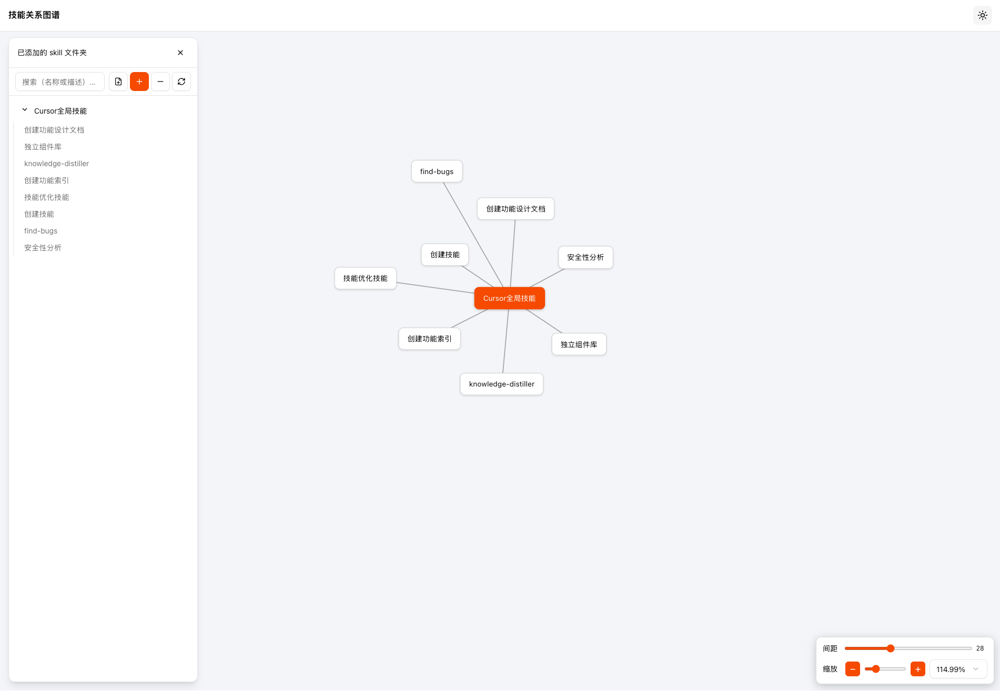

# Agent Skills Visualization

An Electron application with Vue and TypeScript


## Recommended IDE Setup

- [VSCode](https://code.visualstudio.com/) + [ESLint](https://marketplace.visualstudio.com/items?itemName=dbaeumer.vscode-eslint) + [Prettier](https://marketplace.visualstudio.com/items?itemName=esbenp.prettier-vscode) + [Volar](https://marketplace.visualstudio.com/items?itemName=Vue.volar)

## Project Setup

### Install

```bash
$ pnpm install
```

### Development

```bash
$ pnpm dev
```

### Build

```bash
# For windows
$ pnpm build:win

# For macOS（需钥匙串中有 Developer ID 证书）
$ pnpm build:mac

# macOS 本地构建（不签名，避免无证书或 macOS 15 Team ID 不一致导致启动崩溃）
$ pnpm build:mac:unsigned

# 若打开 .app 提示「已损坏」：在终端执行以移除隔离属性
# xattr -cr "dist/mac-arm64/Agent Skills Visualization.app"
```

**macOS 15 启动崩溃（主程序与 Electron Framework 签名 Team ID 不一致）**  
若用 `build:mac` 构建后打开即崩溃，多为未用同一 Developer ID 签名整包。请改用 `pnpm build:mac:unsigned` 做本地构建；正式分发时需在钥匙串中配置 **Developer ID Application** 证书并只用该身份签名。

### 如何获得 Developer ID 证书并用于正式签名

1. **加入 Apple Developer Program**  
   - 打开 [Apple Developer Program](https://developer.apple.com/programs/) 并注册/登录。  
   - 需付费会员（按年），才能申请 Developer ID 证书。

2. **在 Mac 上创建证书签名请求（CSR）**  
   - 打开 **钥匙串访问**（`/应用程序/实用工具/钥匙串访问.app`）。  
   - 菜单栏：**钥匙串访问 → 证书助理 → 从证书颁发机构请求证书…**  
   - 填写 **用户电子邮件地址**、**常用名称**（如：My Dev Key），**存储到磁盘**，保存为 `.certSigningRequest` 文件。  
   - 官方说明：[创建证书签名请求](https://developer.apple.com/help/account/certificates/create-a-certificate-signing-request)

3. **在 Apple 开发者网站申请 Developer ID Application 证书**  
   - 登录 [Certificates, Identifiers & Profiles](https://developer.apple.com/account/resources)。  
   - 左侧选 **Certificates**，点击 **+** 新建。  
   - 在 **Software** 下选 **Developer ID**，再选 **Developer ID Application**（用于签名 Mac 应用，不是 Installer）。  
   - 按页面提示上传刚保存的 `.certSigningRequest` 文件，完成后 **Download** 下载 `.cer` 证书。  
   - 官方说明：[Developer ID 证书](https://developer.apple.com/help/account/certificates/create-developer-id-certificates)

4. **安装证书到钥匙串**  
   - 双击下载的 `.cer` 文件，证书会加入「登录」钥匙串的「我的证书」中。

5. **用该证书构建并签名**  
   - 本机只保留/使用一个 **Developer ID Application** 证书时，直接执行：  
     `pnpm build:mac`  
   - 若有多张证书，可指定身份再构建：  
     `CSC_NAME="Developer ID Application: 你的姓名 (TEAM_ID)" pnpm build:mac`  
     （在钥匙串中查看证书全名，TEAM_ID 在 [Apple Developer 账户页面](https://developer.apple.com/account) 的 Membership 中可见。）

```bash
# For Linux
$ pnpm build:linux
```
