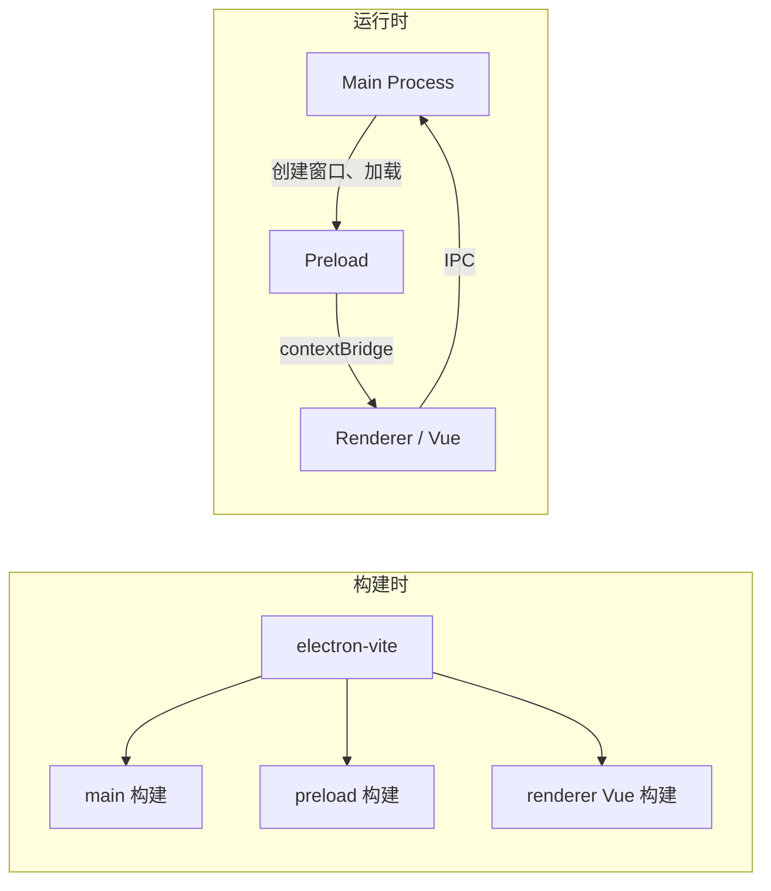
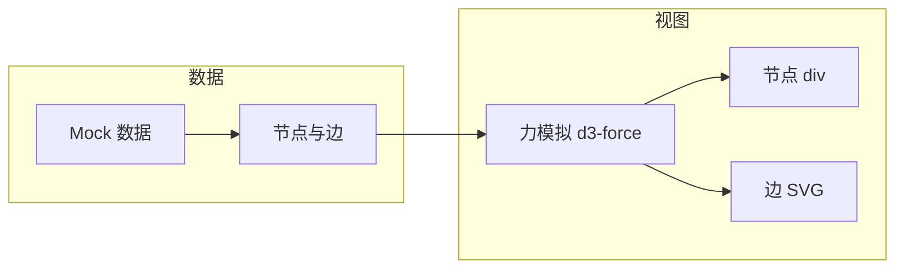

# 设计文档：Agent Skills Visualization

基于 [requirements.md](./requirements.md) 与当前项目结构、用户对话（项目启动方式）编写。

---

## 1. 概述

### 1.1 目标

Agent Skills Visualization 是一款基于 **Electron + Vue 3 + TypeScript** 的桌面应用（仓库名：`agent-skills-visualization`）。设计文档覆盖：

- 开发与运行方式（安装依赖、开发模式、构建与多平台打包）
- 主进程、预加载、渲染进程的职责与通信
- 技能关系图谱：力导向布局、节点形态、模拟数据示例与后续脚本解析预留
- 构建与类型体系、错误处理与测试策略

### 1.2 与需求的对应

| 需求范围 | 设计对应 |
|----------|----------|
| REQ-1～REQ-4 开发与运行 | 架构中的构建/脚本、README/文档约定 |
| REQ-5～REQ-6 构建与分发 | 架构中的 electron-vite 与 electron-builder |
| REQ-7～REQ-10 应用能力 | 组件与接口、数据模型、错误处理 |
| REQ-11～REQ-15 技能可视化 | 图谱视图、力模拟、节点/边数据模型、模拟数据与脚本预留 |

---

## 2. 架构

### 2.1 整体架构

采用 Electron 经典三进程模型：**主进程（Main）**、**预加载脚本（Preload）**、**渲染进程（Renderer）**。构建由 electron-vite 统一处理 main / preload / renderer 三端。

### 2.2 目录与入口

- **主进程**：`src/main/index.ts`，入口由 electron-vite 约定（`src/main/index.ts` 或 `main.ts`）。
- **预加载**：`src/preload/index.ts`，主进程创建窗口时通过 `webPreferences.preload` 注入。
- **渲染进程**：`src/renderer/index.html` 为页面入口，Vue 应用入口为 `src/renderer/src/main.ts`。

### 2.3 开发与生产资源加载

- **开发**：主进程通过 `process.env['ELECTRON_RENDERER_URL']` 加载 Vite 开发服务器 URL，实现 HMR。
- **生产**：主进程通过 `loadFile(join(__dirname, '../renderer/index.html'))` 加载本地打包后的 renderer。

### 2.4 图谱视图数据流

技能关系图谱的数据流：模拟数据（或后续主进程解析 skills 目录结果）→ 图谱组件 → d3-force 力模拟 → 节点（div）与边（SVG）渲染。

### 2.5 与需求的对应

- REQ-1～REQ-4：由 `package.json` 的 scripts（`pnpm install` / `pnpm dev` / `pnpm start`）与 README 说明满足。
- REQ-5～REQ-6：由 `electron-vite build` 与 `electron-builder` 的脚本满足。
- REQ-7～REQ-10：由下面「组件与接口」与「数据模型」具体实现。
- REQ-11～REQ-15：由「关系图谱」视图组件、力模拟、节点/边数据模型及模拟数据满足；脚本解析 skills 目录为后续迭代，主进程 IPC 预留接口。

---

## 3. 组件与接口

### 3.1 主进程（Main）

| 职责 | 说明 | 对应需求 |
|------|------|----------|
| 窗口创建 | `createWindow()`：宽高、图标、preload 路径、安全策略 | REQ-7 |
| 生命周期 | `app.whenReady()`、`activate`、`window-all-closed`（macOS 不退出） | REQ-7 |
| 外部链接 | `setWindowOpenHandler` → `shell.openExternal`，禁止在应用内开新窗口 | REQ-7 |
| 开发工具 | 通过 @electron-toolkit/utils 的 `watchWindowShortcuts` 实现 F12 等 | REQ-7 |
| IPC | `ipcMain.on('ping')` 等，供渲染进程调用 | REQ-9 |

**接口**：主进程不对外暴露 TS 接口，通过 IPC 与 preload 暴露的 API 与渲染进程通信。

### 3.2 预加载（Preload）

| 职责 | 说明 | 对应需求 |
|------|------|----------|
| 暴露 API | 使用 `contextBridge.exposeInMainWorld('electron', electronAPI)`（@electron-toolkit/preload） | REQ-8 |
| 扩展 API | 预留 `api` 对象，便于后续扩展自定义暴露方法 | REQ-8 |
| 上下文隔离 | 仅在 `process.contextIsolated` 为 true 时使用 contextBridge | REQ-8 |

**接口**：渲染进程通过 `window.electron`（类型见 `preload/index.d.ts`）和 `window.api` 访问。

### 3.3 渲染进程（Renderer）

| 组件/模块 | 说明 | 对应需求 |
|-----------|------|----------|
| `App.vue` | 根组件，展示 UI 并调用 `window.electron.ipcRenderer.send('ping')` | REQ-9 |
| `Versions.vue` | 展示 `window.electron.process.versions`（Electron/Chromium/Node 版本） | REQ-9 |
| Vue 3 + TS | Composition API、`<script setup>`，类型与 `env.d.ts` / `preload/index.d.ts` 一致 | REQ-9 |
| `GraphView.vue` | 关系图谱视图：承载画布、力模拟、节点（div）与边（SVG）；技能节点圆角矩形、目录节点圆形，连接点均为节点中心；节点可拖拽 | REQ-12～REQ-15 |

**接口**：依赖 `Window.electron` 与 `Window.api`（见数据模型一节）。

### 3.4 关系图谱组件

| 职责 | 说明 | 对应需求 |
|------|------|----------|
| 力模拟 | 使用 d3-force：`forceManyBody` 排斥、`forceCenter` 向中心吸引、`forceLink` 边、`forceCollide` 防重叠；拖拽时对被拖节点设 `fx/fy`，结束时清除并 `simulation.alpha(1).restart()` | REQ-12、REQ-13 |
| 节点渲染 | 节点为 div：技能节点 `border-radius` 圆角矩形，目录节点 `border-radius: 50%`；定位以中心为基准（`transform: translate`）；可填充内容 | REQ-13、REQ-14 |
| 边渲染 | 同一容器内 SVG overlay，线从 source/target 的几何中心连到中心（`x1/y1/x2/y2`） | REQ-13、REQ-14 |
| 数据 | 示例阶段使用 `mockGraph.ts`；后续由主进程解析 skills 目录经 IPC 传入 | REQ-11、REQ-15 |

### 3.5 构建配置

- **electron.vite.config.ts**：`defineConfig` 下 `main`、`preload`、`renderer` 三块；renderer 使用 `@vitejs/plugin-vue` 与 `@renderer` 别名。
- **package.json scripts**：`dev`（electron-vite dev）、`start`（preview）、`build`（typecheck + electron-vite build）、`build:win/mac/linux`（electron-builder）。

---

## 4. 数据模型

### 4.1 图谱节点与边（技能可视化）

- **GraphNode**：`id`、`label`、`type: 'skill' | 'directory'`；力模拟用 `x?`、`y?`、`fx?`、`fy?`（拖拽时固定位置）。定义于 `src/renderer/src/types/graph.ts`。
- **GraphEdge**：`source`、`target`（节点 id 或引用，与 d3-force 的 `forceLink` 一致）。定义于同文件。
- **模拟数据**：`src/renderer/src/data/mockGraph.ts` 导出一份：1 个 directory 节点 + 若干 skill 节点；边为每个 skill → directory，可选 skill→skill 用于展示关系。示例阶段不依赖真实目录解析。

### 4.2 进程间无持久化数据

当前功能不涉及数据库或持久化存储；图谱数据为前端状态或由主进程经 IPC 传入。数据模型还描述「进程间约定」与「类型」。

### 4.3 渲染进程可见的类型（Window）

- **window.electron**：来自 @electron-toolkit/preload 的 `ElectronAPI`，包含但不限于：
  - `process.versions`：`{ electron, chrome, node, ... }`
  - `ipcRenderer.send(channel, ...args)` 等
- **window.api**：当前为 `unknown`，预留给自定义 API。

定义位置：`src/preload/index.d.ts`（全局声明 `Window` 接口）。

### 4.4 与需求的对应

- REQ-8、REQ-9：通过 `Window.electron` 与 `Window.api` 的类型与实现满足。
- AC-4：通过 `ping`/`pong` IPC 与 `process.versions` 的展示验证。

---

## 5. 错误处理

### 5.1 预加载脚本

- **contextBridge 失败**：`exposeInMainWorld` 置于 try/catch，失败时 `console.error`，不抛到主进程，避免白屏无提示。
- **contextIsolated 为 false**：回退到 `window.electron` / `window.api` 直接挂载，保证兼容。

### 5.2 主进程

- **窗口创建**：未单独 catch；若创建失败，Electron 会报错，可后续增加日志或用户提示。
- **外部链接**：一律 `shell.openExternal`，不依赖返回值，无额外错误分支。

### 5.3 渲染进程

- **Vue 应用**：依赖 Vue 与 Vite 默认错误边界与 HMR 错误展示；未单独定义业务错误码。
- **IPC 调用**：示例仅 `send('ping')`，无返回值校验；若后续增加 invoke/handle，需约定超时与错误码。

### 5.4 图谱视图

- **数据为空或解析失败**：不渲染力模拟，显示占位提示（如「暂无图谱数据」），不崩溃。后续主进程解析失败时可通过 IPC 返回错误，渲染端同样显示占位。

### 5.5 构建与启动

- **类型错误**：`pnpm build` 先执行 `typecheck`，失败则中止构建，满足 REQ-5。
- **依赖安装**：`pnpm install` 失败时由 pnpm 报错；`postinstall`（electron-builder install-app-deps）失败会中断安装。

### 5.6 与需求的对应

- REQ-4（文档）：README 中说明安装与启动步骤，减少因环境或命令错误导致的启动失败。
- 其他需求未明确要求复杂错误码或用户可见错误页，当前设计以「不崩溃、可排查」为主。

---

## 6. 测试策略

### 6.1 当前覆盖范围

- **AC-1**：安装与启动 — 通过文档与手动验证（`pnpm install` + `pnpm dev`）。
- **AC-2**：开发模式与 HMR — 手动验证。
- **AC-3**：构建 — 通过 `pnpm build` 及 typecheck 验证。
- **AC-4**：IPC — 通过主进程 `ipcMain.on('ping')` 与渲染进程点击「Send IPC」手动验证。
- **AC-5**：文档 — 通过 README 内容审查。
- **AC-6～AC-8**：图谱 — 手动验证：节点形状（圆角矩形/圆形）、连线中心到中心、力导向与拖拽、模拟数据示例展示。

### 6.2 建议的自动化测试（后续）

| 类型 | 对象 | 方式 |
|------|------|------|
| 单元 | 渲染进程 Vue 组件（如 Versions） | Vitest + Vue Test Utils，mock `window.electron` |
| 单元 | 主进程工具函数（若有抽离） | Vitest + 多进程/ mock |
| E2E | 窗口启动 + 简单点击/IPC | Spectron 或 Playwright for Electron |

### 6.3 基于属性的测试（PBT）

当前需求主要为「启动、构建、IPC 示例」，无解析器、序列化、复杂数据结构或需不变性/幂等性保证的算法，**不引入 PBT**。若后续增加配置解析、序列化等模块，再评估 PBT。

### 6.4 与需求的对应

- 每个 AC 均有对应验证方式（手动或建议的自动化）。
- 测试策略不引入超出需求范围的设计（无 scope creep）。

---

## 7. 自检清单（与 requirements 对照）

- [x] requirements.md 中每条需求在设计中有对应（脚本、架构、组件、接口、错误处理或测试）。
- [x] 所有验收标准可追溯到具体组件或接口或验证方式。
- [x] 数据模型支持需求中的「暴露 API、IPC、类型一致」。
- [x] 错误处理覆盖预加载、构建、启动等失败场景。
- [x] 测试策略覆盖所有 AC。
- [x] 无超出 requirements 的设计范围。
- [x] REQ-11～REQ-15 在 design 中均有对应（组件、数据模型、力模拟、节点形态）。
- [x] AC-6～AC-8 可追溯到 GraphView、d3-force、节点/边渲染与拖拽；示例仅用模拟数据，脚本解析为预留。

---

## 8. 参考与引用

- [electron-vite 官方文档](https://electron-vite.org/)（项目结构、开发与配置）
- 当前仓库：`package.json`、`electron.vite.config.ts`、`src/main/index.ts`、`src/preload/index.ts`、`src/renderer/src/App.vue`、`README.md`
- 用户对话：项目启动方式（`pnpm install`、`pnpm dev`、`pnpm start`、构建命令）已纳入需求与本文档「架构」「组件与接口」和 README 说明。
- 技能可视化：力导向采用 d3-force；节点 div + 边 SVG；脚本解析 skills 目录为后续迭代，主进程 IPC 接口预留。
